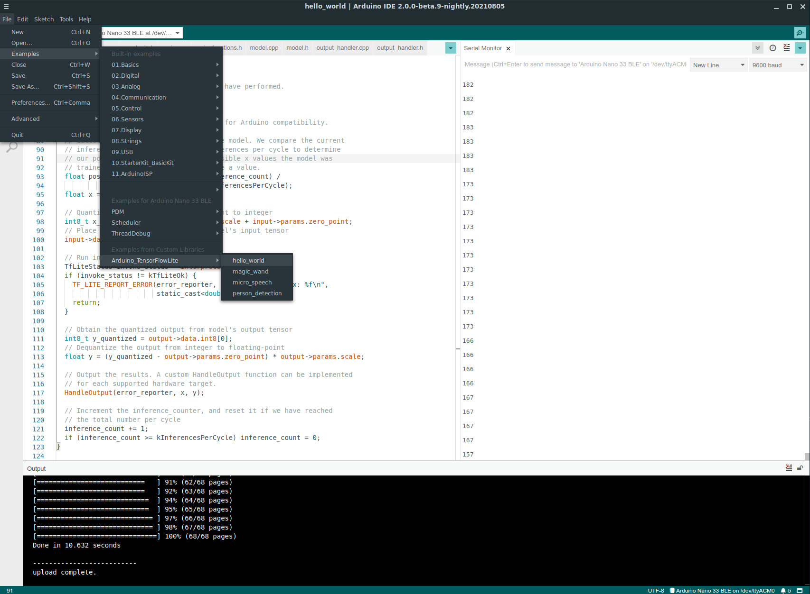

# TensorFlow Lite Micro Library for Arduino

This repository has the code (including examples) needed to use Tensorflow Lite Micro on an Arduino.

## Build Status

Build Type          |     Status    |
---------------     | ------------- |
Arduino CLI on Linux  | [](https://github.com/tensorflow/tflite-micro-arduino-examples/actions/workflows/ci.yml)
Sync from tflite-micro  | [](https://github.com/tensorflow/tflite-micro-arduino-examples/actions/workflows/sync.yml)

## Corrections

- Resolve Compile Errors for ESP32
- Implement audio_provider.cpp for micro_speech exmples based on arduino-audio-tools


## How to Install

### GitHub

If you want to install an in-development version of this library, you can use the
latest version directly from this GitHub repository. This requires you clone the
repo into the folder that holds libraries for the Arduino IDE. The location for
this folder varies by operating system, but typically it's in
`~/Arduino/libraries` on Linux, `~/Documents/Arduino/libraries/` on MacOS, and
`My Documents\Arduino\Libraries` on Windows.

Once you're in that folder in the terminal, you can then grab the code using the
git command line tool:

```bash
git clone https://github.com/tensorflow/tflite-micro-arduino-examples Arduino_TensorFlowLite
```

### Checking your Installation

Once the library has been installed, you should see an Arduino_TensorFlowLite
entry in the File->Examples menu of the Arduino IDE. This submenu contains a list
of sample projects you can try out.



## Compatibility

This library is designed for the Arduino Nano BLE Sense 33 board. The framework
code for running machine learning models should be compatible with most Arm Cortex
M-based boards, such as the Raspberry Pi Pico, but the code to access peripherals
like microphones, cameras, and accelerometers is specific to the Nano.

## License

This code is made available under the Apache 2 license.

## Contributing

Forks of this library are welcome and encouraged. If you have bug reports or
fixes to contribute, the source of this code is at [https:://github.com/tensorflow/tflite-micro](github.com/tensorflow/tflite-micro)
and all issues and pull requests should be directed there.

The code here is created through an automatic project generation process from
that source of truth, since it's cross-platform and needs to be modified to
work within the Arduino IDE.