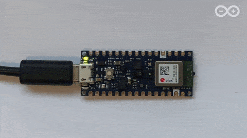

<!-- mdformat off(b/169948621#comment2) -->

# Micro Speech Example

This example shows how to run a 20 kB model that can recognize 2 keywords,
"yes" and "no", from speech data.

The application listens to its surroundings with a microphone and indicates
when it has detected a word by lighting an LED or displaying data on a
screen, depending on the capabilities of the device.



The code has a small footprint (for example, around 166 kilobytes on a Cortex
M4) and only uses about 54 kilobytes of additional RAM for working memory.

## Table of contents

-   [Deploy to Arduino](#deploy-to-arduino)


## Deploy to Arduino

The following instructions will help you build and deploy this example to
[Arduino](https://www.arduino.cc/) devices.

The example has been tested with the following devices:

- [Arduino Nano 33 BLE Sense](https://store.arduino.cc/usa/nano-33-ble-sense-with-headers)

The Arduino Nano 33 BLE Sense is currently the only Arduino with a built-in
microphone. If you're using a different Arduino board and attaching your own
microphone, you'll need to implement your own `audio_provider.cpp` code. It also has a
set of LEDs, which are used to indicate that a word has been recognized.

### Install the Arduino_TensorFlowLite library

This example application is included as part of the official TensorFlow Lite
Arduino library. To install it, open the Arduino library manager in
`Tools -> Manage Libraries...` and search for `Arduino_TensorFlowLite`.

### Load and run the example

Once the library has been added, go to `File -> Examples`. You should see an
example near the bottom of the list named `TensorFlowLite:micro_speech`. Select
it and click `micro_speech` to load the example.

Use the Arduino IDE to build and upload the example. Once it is running, you
should see the built-in LED on your device flashing. The built-in LED will flash on/off for each inference cycle. Saying the word "yes" will
cause the green LED to remain on for 3 seconds. The current model has fairly low
accuracy, so you may have to repeat "yes" a few times. Saying the word "no" will cause the red LED to light up.  The blue LED will be lit for certain "unknown" sounds.

Word recognition should occur at a distance of approximately 1.5 feet in a low-noise environment.

The program also outputs inference results to the serial port, which appear as
follows:

```
Heard yes (201) @4056ms
Heard no (205) @6448ms
Heard unknown (201) @13696ms
Heard yes (205) @15000ms
```

The number after each detected word is its score. By default, the program only
considers matches as valid if their score is over 200, so all of the scores you
see will be at least 200.

When the program is run, it waits several seconds for a USB-serial connection to be
available. If there is no connection available, it will not output data. To see
the serial output in the Arduino desktop IDE, do the following:

1. Open the Arduino IDE
1. Connect the Arduino board to your computer via USB
1. Press the reset button on the Arduino board
1. Within 5 seconds, go to `Tools -> Serial Monitor` in the Arduino IDE. You may
   have to try several times, since the board will take a moment to connect.

If you don't see any output, repeat the process again.

